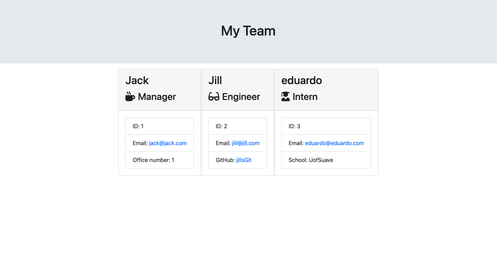

# hmwk9-OOP

# Table of Contents

- [Author](##Author)
- [Project Description](##Description)
- [Install](##Install)
- [Usage](##Usage)
- [Testing](##Testing)
- [License](##License)
- [Contributors](##Contributors)
- [Questions](##Questions)

## Author

Name: Jack Murphy
GitHub: jmurphy0

## Description

This project uses node to build a development team via user input.

## Install

insall using npm inquirer, path

## Usage

User must first make a manager, then will be promted to add team members. Either a engineer or an intern will be added to the team using input by user. Output file will contain the HTML output.

## Testing

test this with the test files provided using jest

## License

## Contributors

no

## Questions

no

demo videos are in assets folder of repo

